# Django Hybrid Search

[](https://github.com/samiulhuda360/django-hybrid-search/actions/workflows/ci.yml)


*A recording of the running app. Someone types "files disappear after every deploy". The app finds the page
called "Object storage", writes a short answer that cites it, and highlights the matching words. Switching to
keyword-only ranking shows how each method ranks the same pages.*

## What it does

Django Hybrid Search is a small search engine for a documentation website. It visits the site politely, reads
every page, and builds a search index. People can then search in their own words, not only in the words the
writer used.

It ranks pages in two ways at once:

- **by matching words** (BM25, the classic search-engine formula), which is good at exact terms such as
  `CNAME` or `exit code 137`;
- **by meaning** (sentence embeddings from a small AI model), which understands that "undo a bad release" is about
  a page called "Roll back a release".

The two rankings are merged, so a page that either method finds near the top comes up. On top of the results it
can write a short answer with numbered links to the pages it used. Without an AI key it quotes the most relevant
sentences instead.

**Key features**

- A polite crawler: it reads `robots.txt`, follows the sitemap, honours `Crawl-delay`, stays on one site, and
  skips duplicates, non-HTML files and pages marked `noindex`.
- Hybrid ranking: BM25 and embeddings merged with Reciprocal Rank Fusion. Each method can also be used alone.
- Search-as-you-type suggestions, "Did you mean" spelling fixes, and snippets with the matching words highlighted.
- An optional AI answer that cites its sources. It is cached on disk, rate-limited and checked: citations that
  point at no source are removed.
- Django admin for crawl jobs: create a job, run it in the background, read its log, and inspect every page.
- A labelled evaluation of 59 queries that compares BM25, embeddings and hybrid with nDCG@10, MRR@10 and Recall@5.
- A bundled demo website (the docs of "Acme Deploy", a made-up hosting product), so everything runs offline.

## A real-life example

Priya leads customer support at Acme Deploy, a small hosting company with 42 pages of help docs.

**Before:** the docs site had a plain keyword search. Customers wrote "files disappear after every deploy" or
"undo a bad release", found nothing useful, and opened a ticket. Priya's team answered the same questions every
week by pasting links to pages that already existed.

**With Django Hybrid Search:**

1. Priya adds a crawl job in the admin with the docs address and clicks **Run**. A minute later all 42 pages are
   indexed. The internal on-call runbook is skipped, because `robots.txt` blocks it.
2. A customer types "files disappear after every deploy". The first result is "Object storage", with the
   sentence "It is wiped on every deploy" highlighted.
3. Above the results, a two-sentence answer explains that the instance disk is temporary and that files belong in
   object storage. Each sentence ends with a numbered link to its source page.
4. When the docs change, Priya runs the job again and the index rebuilds itself.

**After:** on the labelled test set of plain-language questions, 90% of the pages that fully answer them appear
in the top five results with hybrid ranking, against 80% with keyword search alone (Recall@5, 35 queries).

## How you would use it

1. Run `python manage.py demo`. It crawls the bundled docs site, builds the index and opens the app at
   <http://127.0.0.1:8000/>.
2. Type a question the way you would ask a colleague. Pick a suggestion or press Enter.
3. Read the answer at the top and click a numbered source to open that page. The results below show where each
   page ranked by keywords and by meaning.
4. Use the **Hybrid / Keyword / Semantic** tabs to compare the ranking methods on the same question.
5. To search your own site, open the admin at `/admin/`, add a **Crawl job** with your site's address, select it
   and choose **Run selected crawl jobs now**. Or run `python manage.py crawl https://your-docs.example/`.

## Screenshots

| | |
|---|---|
| 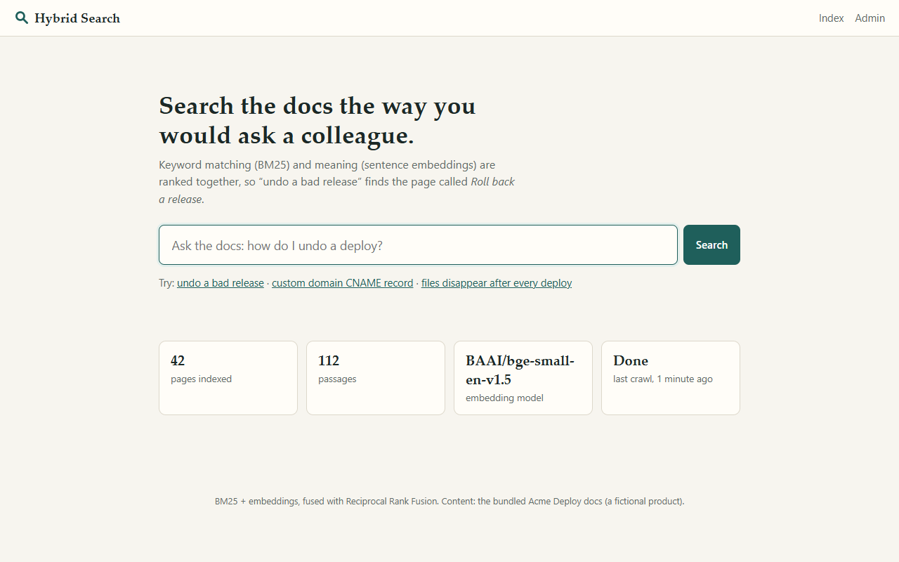 | 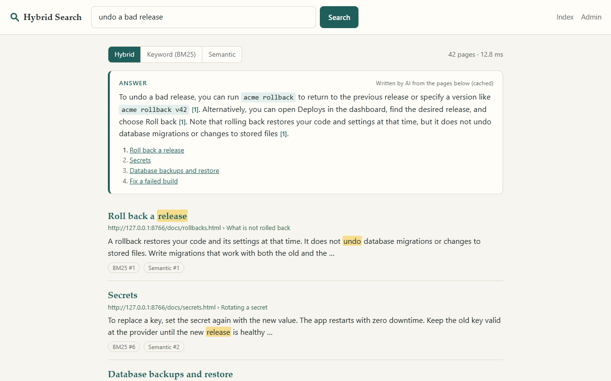 |
| **Home.** The search box, example questions, and what is in the index. | **Results.** An answer that cites page [1], then the ranked pages with highlighted snippets and each method's rank. |
| 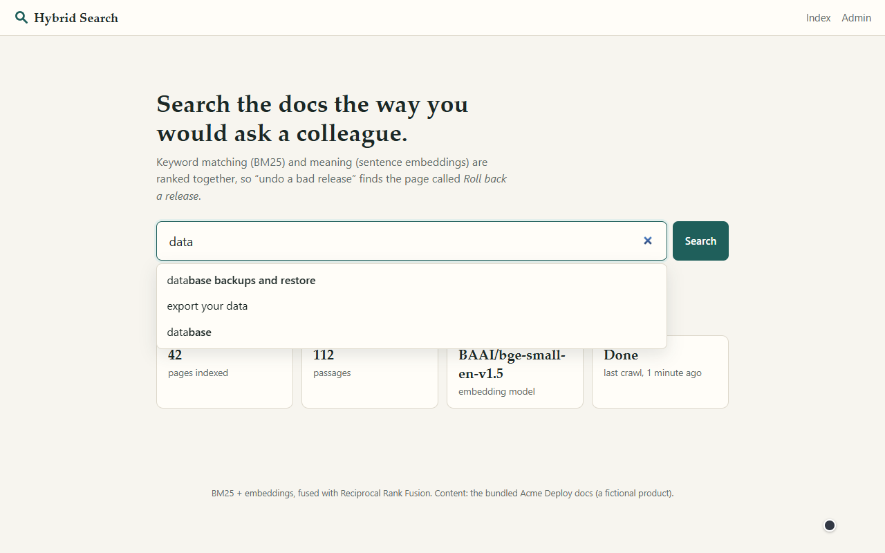 | 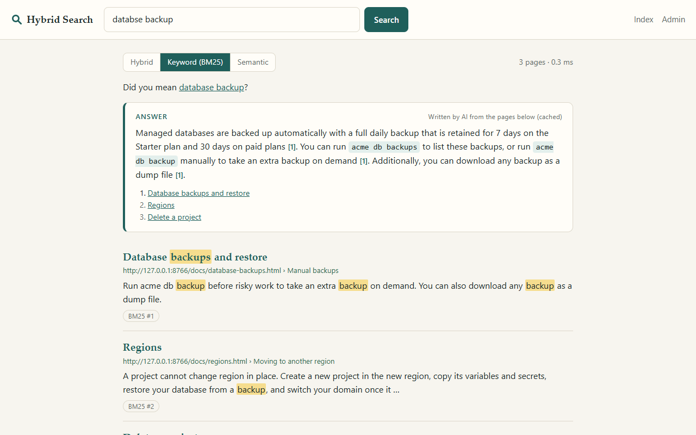 |
| **Suggestions** come from page titles, the index vocabulary and earlier searches. | **Did you mean** fixes misspellings against the words in the index. |
| 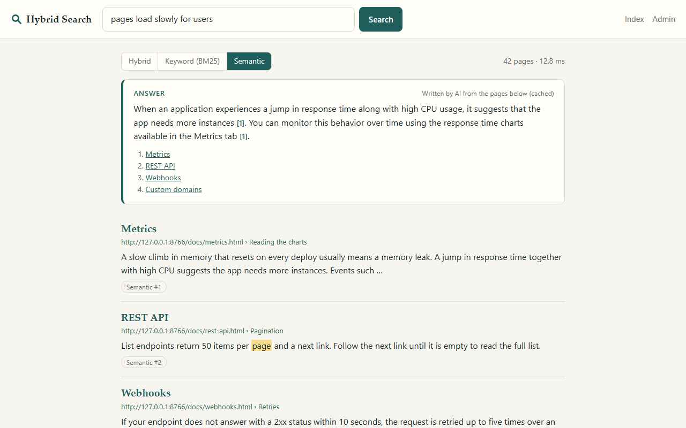 | 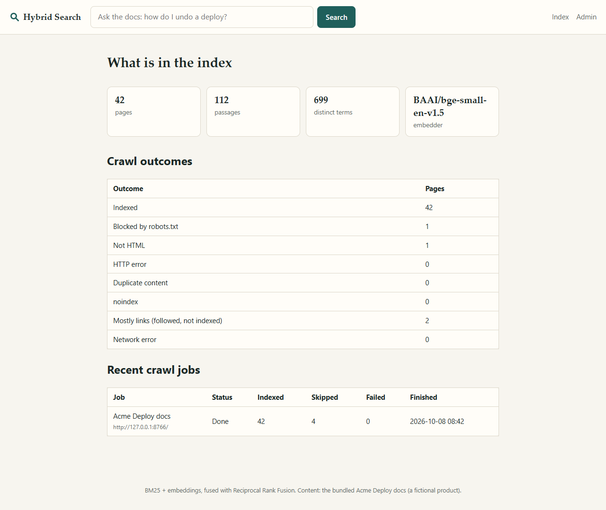 |
| **Semantic mode** finds "Metrics" for "pages load slowly for users", a page with none of those words. | **Index page:** pages, passages, distinct terms, and every crawl outcome. |
| 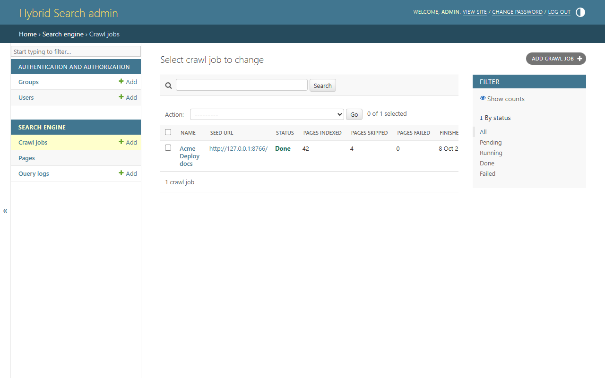 | 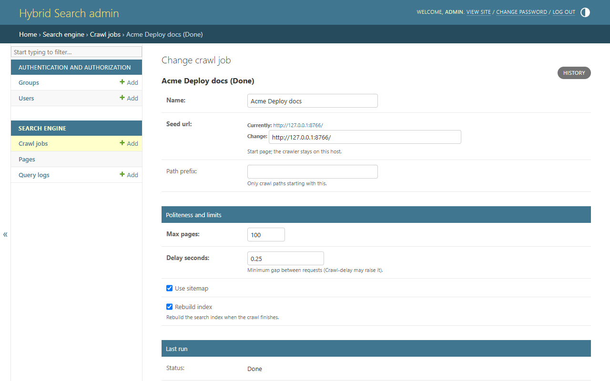 |
| **Admin: crawl jobs**, with status and counts. Actions run a job or rebuild the index. | **Admin: one crawl job**, with its politeness settings and the result of its last run. |

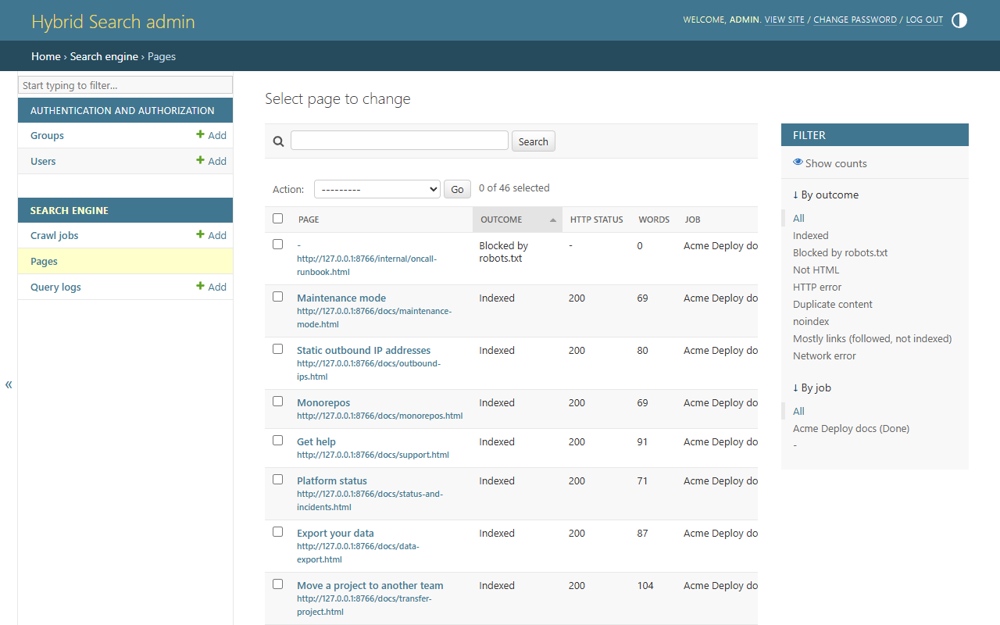

*Admin: every URL the crawler met, with its outcome (indexed, blocked by robots.txt, not HTML, mostly links and
so on), HTTP status and word count.*

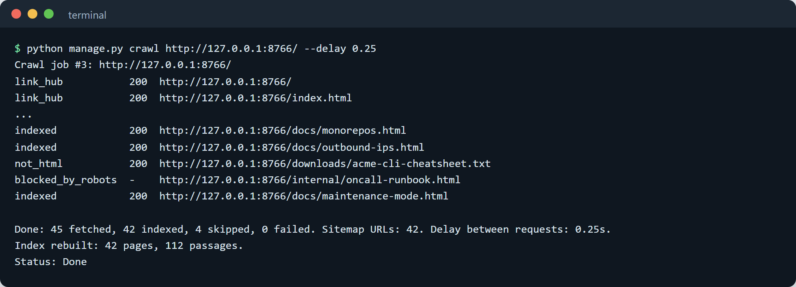

## Architecture

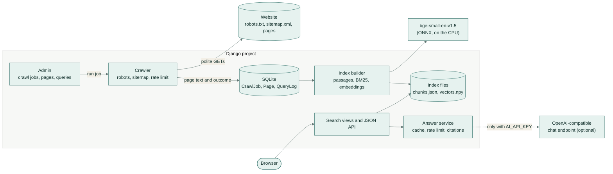

## How it works

### Crawling and indexing

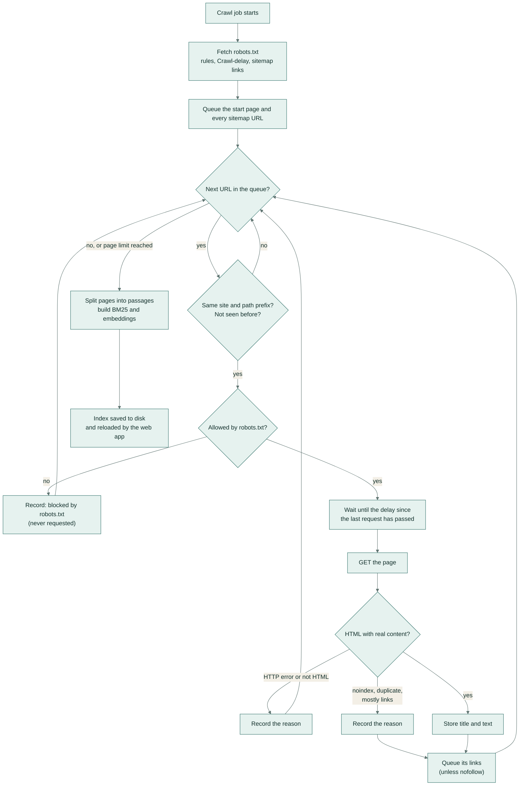

1. **Politeness.** The crawler reads `robots.txt` first and never requests a disallowed URL. Requests are spaced
   by the job's delay or the site's `Crawl-delay`, whichever is longer, and carry a clear User-Agent.
2. **Discovery.** URLs come from the sitemap and from links on each page. URLs are normalised (no fragment or
   query string) so the same page is fetched once.
3. **Extraction.** Navigation, header, footer, scripts and forms are removed; headings and paragraphs from the main
   content are kept. Pages that are mostly links, such as a table of contents, are followed but not indexed,
   because they match almost every query without answering any.
4. **Passages.** Each page is split into passages of up to 120 words under their headings. A very short
   introduction is joined to the next section so no passage is a lone sentence.
5. **Two indexes.** Each passage is turned into stemmed terms for BM25 and into a 384-number embedding with
   `BAAI/bge-small-en-v1.5`, run through ONNX Runtime on the CPU (about 65 MB, no PyTorch).

### Answering a search

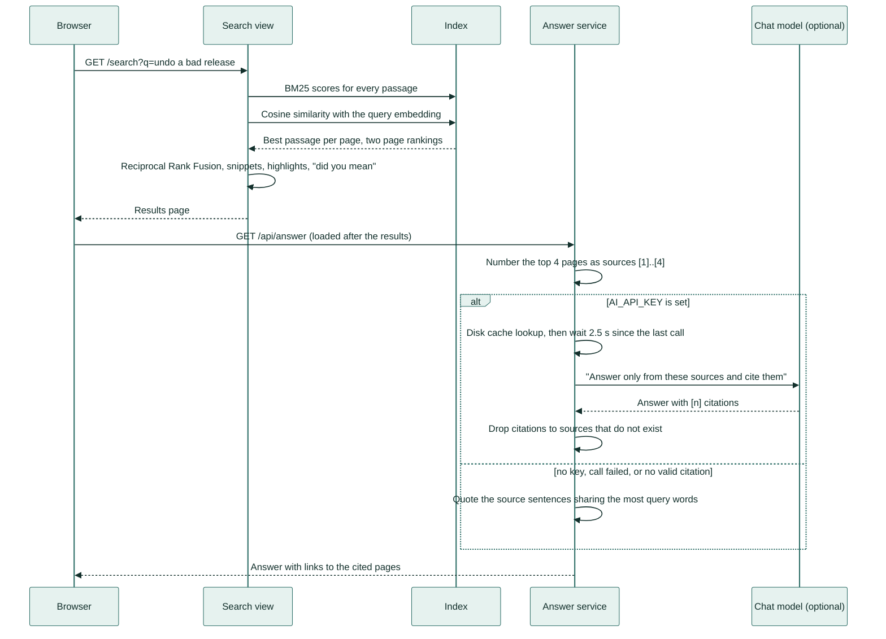

1. **Ranking.** BM25 scores every passage; the embedding model scores every passage by cosine similarity. Each
   page takes the score of its best passage, giving two page rankings.
2. **Fusion.** Hybrid mode merges them with Reciprocal Rank Fusion: `score = 1/(60 + BM25 rank) + 1/(60 + semantic
   rank)`. RRF needs no tuning between the two very different score scales.
3. **Snippets.** The snippet is the 32-word window of the best passage with the most distinct query words.
   Words are matched by stem, so "releases" highlights for "release". All page text is HTML-escaped before the
   `<mark>` tags are added.
4. **Suggestions and spelling.** Suggestions come from earlier searches, page titles, and completions of the last
   word, preferring words that follow the previous word somewhere in the docs. "Did you mean" replaces unknown
   words with a close spelling from the index vocabulary.
5. **Answers.** The results appear at once; the answer loads after them. With `AI_API_KEY` set, the top pages are
   sent to an OpenAI-compatible chat endpoint (Gemini by default) with an instruction to answer only from them and
   cite them. Calls are cached on disk and spaced at least 2.5 seconds apart. Without a key the app quotes the
   source sentences that share the most words with the question, each with its citation.

## Evaluation

59 search queries were written for the bundled docs and each was labelled with the pages that answer it (grade 2)
or are related (grade 1). They come in two kinds:

- **keyword** (24): queries that use the docs' own words, such as "custom domain CNAME record";
- **natural** (35): questions in everyday words, such as "undo a bad release" or "get the padlock in the browser
  for my site".

`python manage.py evaluate` runs every query through each ranking method on the crawled index and writes
[`eval/results.md`](eval/results.md) and [`eval/results.json`](eval/results.json) (including the score of every
query). Current results, with `BAAI/bge-small-en-v1.5`:

| Queries | Method | nDCG@10 | MRR@10 | Recall@5 |
|---|---|---|---|---|
| all (59) | BM25 | 0.819 | 0.808 | 0.881 |
| all (59) | Semantic (embeddings) | 0.840 | **0.832** | 0.873 |
| all (59) | **Hybrid (RRF)** | **0.848** | 0.830 | **0.941** |
| keyword (24) | BM25 | 0.979 | 0.979 | 1.000 |
| keyword (24) | Semantic (embeddings) | 0.956 | 1.000 | 1.000 |
| keyword (24) | **Hybrid (RRF)** | **0.982** | **1.000** | **1.000** |
| natural (35) | BM25 | 0.709 | 0.691 | 0.800 |
| natural (35) | Semantic (embeddings) | **0.761** | **0.716** | 0.786 |
| natural (35) | **Hybrid (RRF)** | 0.755 | 0.713 | **0.900** |

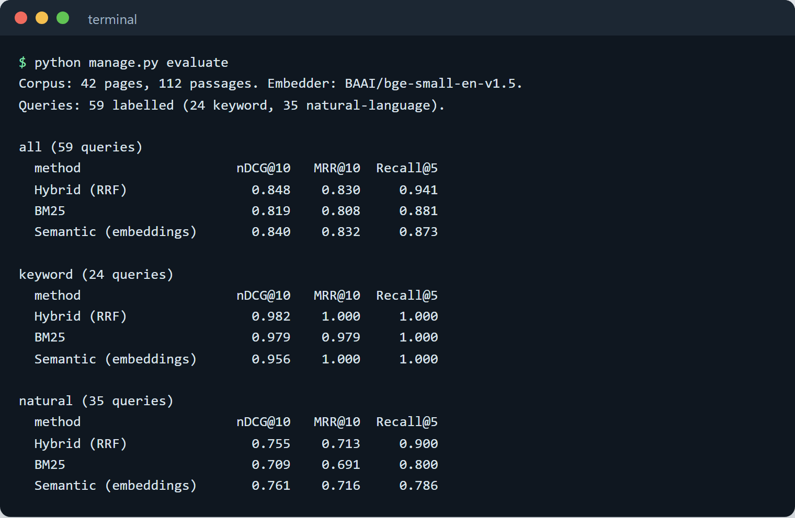

**How to read it**

- **nDCG@10** rewards putting the best pages at the top of the first ten results (1.0 is a perfect order).
- **MRR@10** is 1 divided by the rank of the first page that fully answers the query.
- **Recall@5** is the share of fully answering pages that appear in the top five.
- Hybrid has the best overall nDCG and the best Recall@5. On everyday-language questions 90% of the answering
  pages are in its top five, against 80% for BM25 and 79% for embeddings alone.
- On those questions the embedding ranking alone puts its first answer slightly higher (MRR 0.716 against 0.713).
  RRF favours pages that both methods find, so a page that only the embedding model ranks first can drop a few
  places when BM25 matches other pages on common words. "pages load slowly for users" is the clearest case: the
  embeddings rank "Metrics" first, BM25 matches 12 other pages on "pages" and "users", and the fused ranking
  leaves "Metrics" out of the top ten.
- The set is small (59 queries over 42 pages) and the labels were written by the author of the corpus, so treat
  the numbers as a comparison between methods on this site, not as a general benchmark.

## Tech stack

| Part | Choice |
|---|---|
| Web app and admin | Django 5.2, server-rendered templates, a little plain JavaScript |
| Crawler | `requests`, BeautifulSoup, `urllib.robotparser`, `defusedxml` for sitemaps |
| Keyword ranking | BM25 written with NumPy, Snowball stemmer |
| Semantic ranking | `fastembed` running `BAAI/bge-small-en-v1.5` with ONNX Runtime (no PyTorch) |
| Fusion | Reciprocal Rank Fusion (k = 60) |
| AI answers | `openai` client against any OpenAI-compatible endpoint; Gemini `gemini-flash-lite-latest` by default |
| Storage | SQLite for jobs and pages; JSON and `.npy` files for the index |
| Quality | pytest and pytest-django, ruff, mypy (strict) with django-stubs, GitHub Actions |

## Setup

Requires Python 3.11 or newer.

```bash
git clone https://github.com/samiulhuda360/django-hybrid-search.git
cd django-hybrid-search
make setup        # creates .venv and installs requirements-dev.txt
make demo         # crawls the bundled site, builds the index, serves http://127.0.0.1:8000/
```

Without `make` (for example on Windows):

```bash
python -m venv .venv
.venv/Scripts/pip install -r requirements-dev.txt     # .venv/bin/pip on macOS and Linux
.venv/Scripts/python manage.py demo
```

The first run downloads the embedding model (about 65 MB) into `var/models/`. The demo prints a password for a
local `admin` user. Use `python manage.py demo --no-serve` to build everything without starting the server.

### Configuration

All settings are environment variables; none are required for the demo.

| Variable | Purpose | Default |
|---|---|---|
| `DJANGO_SECRET_KEY` | Django secret key; set it for anything public | a development-only value |
| `DJANGO_DEBUG` | `0` to turn debug off | `1` |
| `DJANGO_ALLOWED_HOSTS` | Comma-separated host names | `127.0.0.1,localhost` |
| `AI_API_KEY` | Key for the chat endpoint; leave unset for quoted answers | unset |
| `AI_BASE_URL` | OpenAI-compatible base URL | Gemini's OpenAI-compatible URL |
| `AI_MODEL` | Chat model name | `gemini-flash-lite-latest` |
| `AI_MIN_INTERVAL_SECONDS` | Minimum gap between chat calls | `2.5` |
| `SEARCH_EMBEDDER` | `fastembed` (real model) or `hash` (offline stand-in used by tests) | `fastembed` |
| `SEARCH_EMBED_MODEL` | Any text model supported by fastembed | `BAAI/bge-small-en-v1.5` |
| `SEARCH_VAR_DIR` | Folder for the database, index, model and answer cache | `var/` |
| `SEARCH_USER_AGENT` | User-Agent sent by the crawler | `HybridSearchBot/1.0 (...)` |

To turn on AI answers, pass the key when you start the server, for example
`AI_API_KEY="$GEMINI_API_KEY" python manage.py runserver`.

### Usage

```bash
python manage.py crawl https://docs.example.com/ --max-pages 200 --delay 1   # crawl a site and rebuild the index
python manage.py crawl https://docs.example.com/ --prefix /guide/            # only crawl under /guide/
python manage.py build_index                                                 # rebuild from stored pages
python manage.py search "undo a bad release" --mode hybrid                   # search from the terminal
python manage.py evaluate                                                    # run the labelled evaluation
python manage.py serve_sample_site --port 8766                               # serve the bundled docs site
```

JSON endpoints: `GET /api/search?q=...&mode=hybrid|bm25|semantic`, `GET /api/suggest?q=...` and
`GET /api/answer?q=...`.

## Project structure

```text
config/                  Django settings and URLs
search/
  crawler.py             polite crawler: robots.txt, sitemaps, rate limit, extraction
  text.py                tokenising, stemming, splitting pages into passages
  bm25.py                BM25 scoring over an inverted index
  embeddings.py          fastembed model and the offline hashing embedder
  index.py               search index: build, save, load, BM25 / semantic / hybrid ranking
  snippets.py            snippet window and safe highlighting
  suggest.py             suggestions and "did you mean"
  answer.py              cited AI answers, disk cache, rate limiter, quoted fallback
  metrics.py             nDCG, MRR, Recall
  evaluation.py          runs the labelled queries through each method
  services.py            runs crawl jobs and rebuilds the index
  admin.py               crawl job, page and query log admin
  views.py, urls.py      search pages and JSON API
  management/commands/   demo, crawl, build_index, search, evaluate, serve_sample_site
  templates/, static/    HTML, CSS and JavaScript
sample_site/
  source.txt             text of the 42 Acme Deploy docs pages
  public/                the generated website, with robots.txt and sitemap.xml
scripts/build_sample_site.py   builds sample_site/public from source.txt
eval/                    labelled queries and the latest results
tests/                   unit and integration tests
docs/screenshots/        screenshots and the demo GIF
```

## Tests

```bash
make lint    # ruff check, ruff format --check, mypy (strict)
make test    # pytest
```

There are 60 tests. They cover BM25 against a hand calculation, Reciprocal Rank Fusion, passage splitting,
snippet escaping and highlighting, suggestions and spelling fixes, the crawler against a real local website
(robots.txt blocking, sitemap discovery, Crawl-delay spacing, nofollow, noindex, duplicates, link hubs, page
limits), the AI answer path with a fake client (citation clean-up, disk cache, fallbacks, rate limiting), the
metrics, the web pages and JSON API, the admin "run" action, and the management commands end to end.

Tests use the offline hashing embedder and never call an AI service. GitHub Actions runs the same lint, type
check and test commands on every push, and checks that the generated sample site matches its source.

## Licence

MIT. See [LICENSE](LICENSE).
